::: logo-position
<!-- No modificar -->

{width="200px"}  <strong> Análisis Avanzado de Datos II </strong>  Facultad de Ciencias Sociales e Historia
:::

# 1 . Investigación reproducible

Nos permite verificar de manera independiente los resultados de un estudio, lo que reforzando su validez y la confianza en el conocimiento producido. Al hacer públicos los datos y el código, se transparenta cómo se llegó a los hallazgos, además, hace posible acumular conocimiento.

## 1.1 Diferenciación **Replicación** y **Reproducibilidad**

**Replicar** es hacer la pelea de nuevo otro investigador, en otro lugar, con datos nuevos, intenta estudiar lo mismo a ver si le da parecido. Es lo ideal, pero muchas veces no se puede hacer (sale caro, toma años, o el contexto ya cambió)

**Reproducir** es agarrar los datos y el código del estudio original y volver a correrlos. Es el mínimo exigibl si alguien publicó un resultado, lo menos que se le puede pedir es que comparta los datos y el código para que cualquiera pueda revisar cómo llegó ahí.

## 1.2 Ciencia Abierta

Marco que cubre cuatro etapas:

-   **Diseño transparente** → publicar hipótesis, procedimientos y plan de análisis.Permite distinguir lo planeado de lo emergente.

-   **Datos abiertos** → publicar 4 elementos: base de datos, cuestionario, libro de códigos y ficha técnica.

-   **Análisis reproducibles** → estructura de proyecto, prácticas de código, documentos dinámicos y control de versiones (lo que nos permite Quarto)

-   **Publicaciones libres** → eliminar barreras económicas al acceso al conocimiento.

# 2. Muestreo Complejo

## 2.1 Muestreo Aleatorio Simple (MAS)

La idea más simple es la de la tómbola gigante donde meter el nombre de cada chileno en un bombo y sacar 1.500 papeles al azar. Todos tienen exactamente la misma probabilidad de salir. Suena perfecto, y de hecho casi toda la estadística básica que aprendieron (medias, intervalos de confianza, test t) asume que los datos vienen de un MAS.

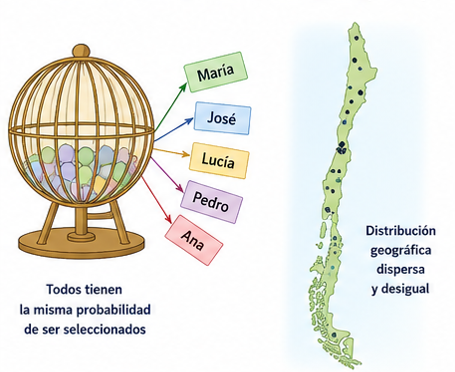 

**El problema es que en la vida real el MAS casi nunca se puede hacer**

::: {.callout-important collapse="true"}
## ¿ Y porque no?

1.  **No existe una lista completa**

imaginate que quieres estudiar a los chilenos, para hacer una tómbola necesitas tener todos los nombres. Pero no hay una lista actualizada de todos los chilenos con su dirección y teléfono. Y si quieres estudiar grupos más específicos (migrantes recientes, trabajadores informales), peor todavía.

2.  **Costoso**

Imagínate que la tómbola te selecciona personas de Arica, Punta Arenas, Isla de Pascua y un cerro perdido en la cordillera. Mandar encuestadores a cada rincón del país es inviable en plata y tiempo

3.  **Pequeños grupos quedan fuera**

Si quieres estudiar a los aymaras de la Región Metropolitana (aprox el 0,1% de la población), con una muestra al azar de 1.500 personas probablemente no te va a tocar ninguno. Y si te toca uno o dos, no puedes hacer análisis serio con eso.
:::

## 2.2 El diseño muestral complejo

Como el MAS no funciona tan bien en la práctica, las encuestas en su mayoria usan tres trucos combinados: estratificación, conglomerados y ponderadores.

------------------------------------------------------------------------

### 1.  **Estratificación**

Es dividir la población en grupos (estratos) antes de hacer la muestra, y muestrear dentro de cada uno

**Para qué sirve**

-   Asegurar que todos los grupos estén representados

-   Mejorar la precisión de las estimaciones

-   Nos permite análisis por estrato

------------------------------------------------------------------------

### 2.  **Muestreo Por Conglomerados**

Es cuando en vez de elegir personas sueltas por todo Chile, elegimos grupos geográficos (manzanas, sectores) y dentro de esos grupos encuestamos varias viviendas.

**tiene algunos problemas**

-   La gente que vive cerca tiende a parecerse más entre sí, entonces cada encuesta dentro de una manzana aporta menos información nueva que una encuesta tomada al azar de cualquier parte del país. Esto hace que las estimaciones sean menos precisas.

-   Cuando combinamos estratificación (sobrerrepresentando algunos grupos) con conglomerados, ya no todos tienen la misma probabilidad de ser encuestados. Eso rompe el supuesto del MAS y obliga a corregir

------------------------------------------------------------------------

...... ¿Cómo Corregimos? ......

### 3.  **Ponderadores**

Son un peso que se le asigna a cada encuestado para indicar a cuántas personas de la población representa. Si una persona tiene un ponderador de 500, significa que en el análisis vale por sí misma + otras 499 personas.

**Incluyen ajuste**

-   Por no respuesta

-   Post estratificación 

___

# 3. Modelos Multivariados

La realidad social es complicada casi nada se explica por una sola causa. Por eso necesitamos modelos multivariados, que son herramientas para analizar varias variables al mismo tiempo y entender cómo se influyen entre sí.

## 3.1 . Regresión y diseño complejo

### 3.1.1 Regresión simple

**Ecuación: ŷ = a + bx**

-   a (intercepto): el valor de Y cuando X = 0.

-   b (pendiente): cuánto cambia Y, en promedio, cuando X aumenta en una unidad. Es lo más importante para interpretar.

------------------------------------------------------------------------

#### **Mínimos Cuadrados Ordinarios (OLS)**

Es la recta que minimiza la suma de los residuos al cuadrado. Un residuo es la distancia vertical entre el valor observado y el predicho por la recta (es básicamente el "error" del modelo en ese punto).

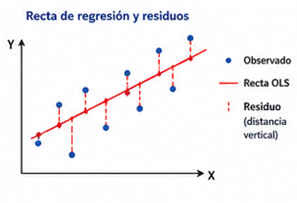

------------------------------------------------------------------------

#### **Análisis de residuos**

-   Si los residuos están dispersos al azar alrededor del cero → el modelo lineal funciona bien (homocedasticidad).

-   Si forman un patrón curvo → la relación no era lineal.

-   Si forman un embudo → varianza no constante (heterocedasticidad), las predicciones son menos confiables en ciertos rangos.

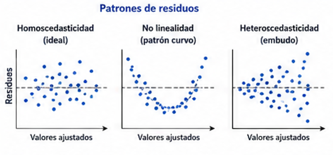

------------------------------------------------------------------------

#### **R2**

El coeficiente de determinación nos dice qué proporción de la variabilidad de Y queda explicada por el modelo, va de 0 a 1. Un R² de 0,13 significa que el modelo explica el 13% de la variación de Y.

------------------------------------------------------------------------

### 3.1.2 Regresión Multiple

Solucionan el problema de la RLS que asume que solo X afecta a Y, lo cual casi nunca es cierto en ciencias sociales.

**Ecuación: Y=b0+b1X1+b2X2+...+bkXk+ϵ**

------------------------------------------------------------------------

#### **Control estadístico**

La Rregresión Lineal Multiple estima el efecto de X₁ sobre Y como si mantuviéramos constantes las demás variables. Es un ajuste matemático que aísla el efecto "puro" de cada predictor.

------------------------------------------------------------------------

#### **Variables categóricas**

-   Dicotómicas (ej. sexo): se codifican 0/1

-   Politómicas (ej. nivel educativo: básico/medio/superior): se crean k–1 dummies dejando una categoría como referencia.

------------------------------------------------------------------------

#### **R2 múltiple vs. R2 ajustado**

-   R2 múltiple: proporción de la varianza de Y explicada por todos los predictores juntos

Problema: se infla si agregas variables irrelevantes.

-   R² ajustado: corrige por el número de predictores. Penaliza la complejidad innecesaria.

Es mejor para comparar modelos con distinto número de variables.

------------------------------------------------------------------------

#### **¿Por qué es importante hacer Regresiones con muestreo complejo?**

lm() asume que cada persona en la muestra fue elegida con la misma probabilidad y de forma independiente, ignorando los estratos, conglomerados y ponderadores.

-   Los coeficientes (b) salen sesgados. Sin usar los ponderadores, el modelo trata por igual a una persona que representa a 100 chilenos y a otra que representa a 1.000. El resultado no refleja a la población real, sino a la muestra "tal como fue elegida", con sus sobrerrepresentaciones.

-   Los errores estándar quedan subestimados. Esto es lo más peligroso. Como las personas dentro de un mismo conglomerado se parecen más entre sí, cada encuesta aporta menos información nueva de la que lm() cree, entregando errores estándar más chicos de lo que realmente son

------------------------------------------------------------------------

## 3.2 Lectura de Regresiones

### **Regresión Lineal Simple**

¿cuánto influye la escolaridad en el ingreso de las personas en Chile? Usamos CASEN 2024, con la variable dependiente ypchautcor (ingreso per cápita autónomo del hogar) y como predictor esc (años de escolaridad). Lo importante: ya declaramos previamente el diseño complejo con svydesign() indicando los estratos (varstrat), conglomerados (varunit) y ponderadores (expr).

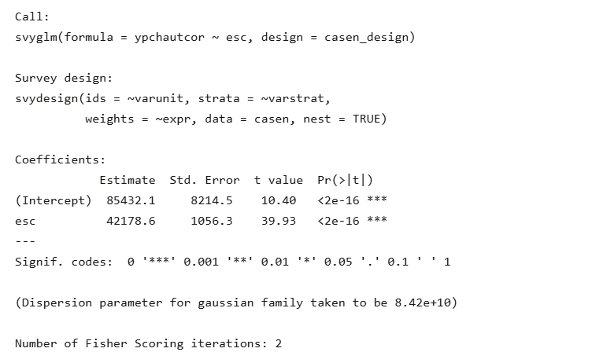

::: {.callout-important collapse="true"}
| Columna         | Qué es                                                |
|-----------------|-------------------------------------------------------|
| **Estimate**    | El valor del coeficiente (b).                         |
| **Std. Error**  | El error estándar (qué tan precisa es la estimación). |
| **t value**     | Estimate dividido por SE.                             |
| **Pr(\>\|t\|)** | El Valor P.                                           |
:::

#### **Intercepto**

`Intercept` = 85432.1

Es el ingreso predicho cuando escolaridad = 0. O sea, una persona con 0 años de educación tendría un ingreso estimado de \$85.432. En este caso sí tiene interpretación práctica (existe gente con 0 años de escolaridad), aunque no siempre la tiene

------------------------------------------------------------------------

#### **Coeficiente**

`esc` = 42178.6

Por cada año adicional de escolaridad, el ingreso per cápita autónomo aumenta en promedio \$42.179, esa es la pendiente el efecto de un año más de educación

------------------------------------------------------------------------

#### **Significancia**

Como p \< 0,05 → rechazamos H₀.

Concluimos que el efecto de la escolaridad sobre el ingreso es estadísticamente significativo en la población chilena

------------------------------------------------------------------------

#### **¿Por qué este p-valor es confiable y el de un lm() no lo sería?**

el error estándar fue calculado considerando que CASEN tiene conglomerados (gente del mismo barrio se parece), estratos (sobrerrepresentación) y ponderadores (cada persona representa a varios). Si hubieras usado lm() ignorando todo eso, el SE habría salido más chico de lo que corresponde, el t más inflado, y podrías haber declarado significativos efectos que en realidad no lo son.

------------------------------------------------------------------------

### Regresión Lineal Multiple

¿cómo influyen la escolaridad, la edad, el sexo y la zona de residencia en el ingreso per cápita autónomo del hogar? Seguimos usando CASEN 2024 con el diseño complejo declarado.

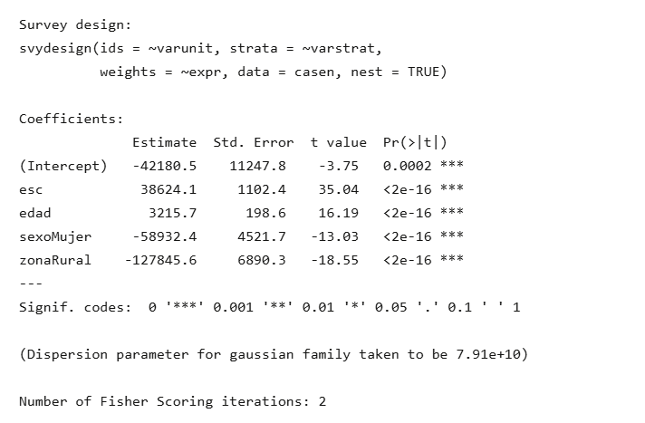

Variables en el modelo:

`ypchautcor` ingreso per cápita autónomo (variable dependiente).

`esc` años de escolaridad (continua).

`edad` edad en años (continua).

`sexo` factor con dos niveles (Hombre = referencia, Mujer).

`zona` factor con dos niveles (Urbana = referencia, Rural).

#### **Intercepto**

`Intercept` = -42180.5

Es el ingreso predicho cuando todas las variables valen cero o están en la categoría de referencia: una persona con 0 años de escolaridad, 0 años de edad, hombre y de zona urbana. El valor sale negativo, lo cual no tiene sentido sustantivo, pero matemáticamente es solo el punto de partida del modelo

___

#### **Coeficiente**

`esc` = 38624.1 

Por cada año adicional de escolaridad, el ingreso per cápita autónomo aumenta en promedio $38.624, controlando por edad, sexo y zona

`edad`= 3215.7

Por cada año adicional de edad, el ingreso aumenta en promedio $3.216, controlando por escolaridad, sexo y zona

`sexoMujer` = -58932.4

Las mujeres ganan en promedio $58.932 menos que los hombres, controlando por escolaridad, edad y zona

`zonaRural` = -127845.6

Las personas que viven en zonas rurales ganan en promedio $127.846 menos que las de zonas urbanas, controlando por escolaridad, edad y sexo

___

#### **Significancia**

Las cuatro variables tienen *** (p < 0,001). En la población chilena hay evidencia  de que las cuatro influyen sobre el ingreso del hogar

# 4. Análisis Factorial

En sociología hay muchos conceptos importantes que no se pueden medir con una sola pregunta: autoritarismo, anomia, capital cultural, bienestar, conciencia de clase, satisfacción laboral. 

Son conceptos abstractos, "construcciones teóricas". En estadística los llamamos variables latentes **no se observan directamente, pero las inferimos a partir de varios indicadores observados que creemos que las reflejan**

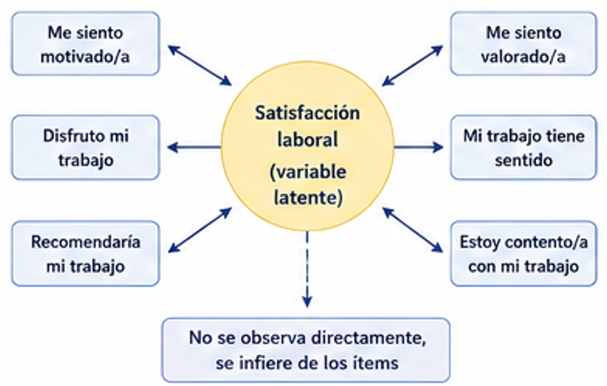

## 4.1 Análisis Factorial Exploratorio 

Es una técnica que busca reducir muchas variables observadas a un número menor de factores latentes

La lógica es simple **si varias variables están altamente correlacionadas entre sí, probablemente están midiendo lo mismo** El AFE detecta esos "grupos" de variables y los resume en factores

Tiene tres objetivos

1. Analizar la estructura de correlaciones: ¿cuántos factores hay detrás

2. Identificar el significado de los factores: ¿qué variables cargan en cada uno?

3.Calcular puntuaciones factoriales: asignarle a cada persona un puntaje en cada factor, que después se puede usar como variable en otros análisis

::: {.callout-important collapse="true"}
 # Diferencia AFE vs ACP (Análisis de Componentes Principales)
 
- ACP → técnica de resumen de datos

Busca capturar la varianza total de las variables, no distingue entre varianza compartida y varianza única

- AFE → técnica de modelado

Asume que detrás de las variables hay factores latentes que las "causan", solo modela la varianza común (la parte compartida).
 
**con ACP describes, con AFE explicas ** 

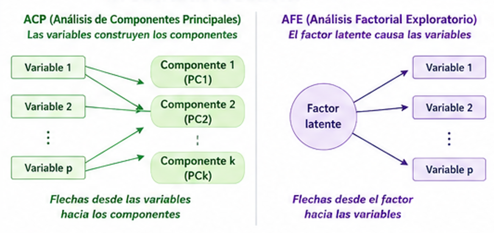

:::

### 4.1.1 6 supuestos del AFE

#### **Nivel de Medición**

El AFE  se diseñó para variables continuas, pero en sociología trabajamos casi siempre con escalas Likert o dicotomicas

- Si las variables tienen pocas categorías (ej. menos de 5-7) Pearson subestima la correlación

- En esos casos hay que usar correlaciones **policóricas** (para ordinales) o **tetracóricas** (para dicotómicas).

___

#### **Tamaño Muestral**

- idealmente N > 200-300

- Si las comunalidades son altas, se puede tolerar muestras más chicas, si son bajas, hay que tener más N

___

#### **Colinealidad**

en AFE necesitamos  que las variables estén correlacionadas,si no lo están, no hay nada que factorizar

- Test de Esfericidad de Bartlett

H0: la matriz de correlaciones es una matriz identidad (las variables NO se correlacionan entre sí)

H|: sí se correlacionan

Queremos rechazar H0 (p < 0,05)

-  Índice KMO (Kaiser-Meyer-Olkin)

Hay un KMO global y un MSA individual por variable

Valores sobre 0,70 son aceptables y un MSA bajo 0,50 puede considerarse la eliminación

___

#### **Normalidad Multivariante**

Se asume normalidad multivariante (las variables siguen una distribución normal) pero esto raramente se cumple

___

#### **Casos Perdidos y Atipicos**

en multivariados se detectan con Distancia de Mahalanobis , valores de Distancia de Mahalanobis con p-valor < 0.001 suelen considerarse atípicos y estos pueden distorsionar el análisis. 
El/La Investigador/a debe decidir que se hara con ellos

___

#### **Estandarización de Variables**

Cuando las variables originales tienen escalas distintas esto puede distorsionar nuestros resultados, por lo tanto de tener variables con escalas distintas podemos trabajar con la matriz de correlaciones en lugar de la matriz de covarianzas

___

### 4.1.2 Cómo realizar el AFE

#### **Selección de variables**

hay que tener claro qué variables  van al análisis según:

- Relevancia Teorica

- Calidad

- Factorabilidad (KMO y barltett)

___

#### **Que factores extraer**

- Pocos factores → simplificas demasiado
- Muchos → factores sin sentido sustantivo

No hay regla única, se combinan varios criterios

**Criterio de Kayser**

El autovalor indica cuánta varianza total explica un factor. Si las variables están estandarizadas (varianza = 1 cada una), retener factores con autovalor > 1 significa quedarse con aquellos que explican más que una variable individual

Ventaja: simple y objetivo

Desventaja: tiende a sobreestimar el número de factores

**Gráfico de sedimentación**

Es un gráfico donde se ordenan los autovalores de mayor a menor. La regla es buscar el punto donde la curva cambia bruscamente 

Se retienen los factores que están antes del codo 

Ventaja: intuitivo y visual

Desventaja: a veces el codo no es claro o hay varios

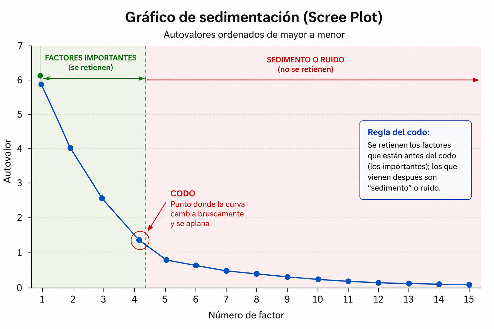

**Analisis Paralelo** 

- Se generan datos aleatorios con el mismo número de variables y casos que los datos reales

-Se calculan los autovalores que daría ese ruido aleatorio

-Solo se retienen los factores reales cuyo autovalor sea mayor que el del ruido aleatorio

___

### 4.1.3 Metodos de Extracción

para estimar las cargas factoriales

**Ejes Principales (PAF) / Mínimos Cuadrados (ULS, OLS, minres)**

no asumen normalidad, son robustos

**Máxima Verosimilitud (ML)**

asume normalidad multivariante. Su gran ventaja es que permite calcular tests de bondad de ajuste e intervalos de confianza. Pero si los datos no son normales, los errores estándar malen sal

___

### 4.1.4 Rotación factorial

La solución factorial inicial casi siempre es difícil de interpretar,  hay variables que cargan moderadamente en varios factores al mismo tiempo, y no se ve qué define a cada factor

la rotación nos entrega una estructura más facil de leer

**Tipos de rotacion**

- Ortogonal (Varimax) 

asume que los factores NO están correlacionados entre si

Conocimientos por área en una prueba
Una evaluación con preguntas de historia, matemáticas, biología y lenguaje. Cada área puede pensarse como un factor independiente del otro → Varimax

- Oblicua (Promax)

permite que los factores SÍ estén correlacionados

Ansiedad y depresión
Son trastornos distintos, con síntomas propios, pero clínicamente sabemos que correlacionan una persona con depresión suele tener síntomas ansiosos también → Promax

### 4.1.5 Cargas Factoriales 

Nos dice la fuerza y dirección de la relación entre el ítem y el factor, si está estandarizada, es básicamente la correlación entre ítem y factor y la proporción de varianza del ítem explicada por el factor

**Cargas factoriales sobre 0.70 suelen ser muy buenas**

4.2 COmo leer un AFE

imagina que el equipo de investigación seleccionó 16 ítems del ELSOC por su relevancia para estudiar distintos aspectos de la vida cotidiana de las personas en Chile

`v1` = Satisfacción con la vida en general

`v2`= Frecuencia con que ve a sus amigos

`v3`= Calidad de la vivienda

`v4`= Interés en la política nacional

`v5`= Satisfacción consigo mismo

`v6` = Apoyo recibido de la familia

`v7`= Suficiencia del ingreso del hogar

`v8`= Asistencia a reuniones comunitarias

`v9``= Satisfacción con sus logros

`v10`= Sentimiento de estar acompañado

`v11`= Estado de salud física

`v12`= Voto en la última elección

`v13`= Satisfacción con el rumbo de su vida

`v14`= Confianza en otras personas

`v15`= Acceso a servicios básicos (agua, luz, internet)

`v16`= Pertenencia a organizaciones sociales

___

#### **Test de KMO y Bartlett**

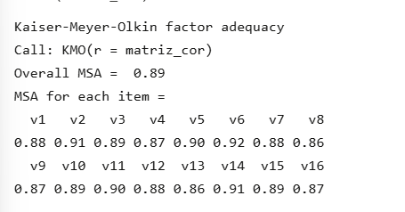

- Bartlett: χ² = 14.238, p < 0,001

Rechazamos H0: los 16 ítems sí están correlacionados entre sí

- KMO global = 0,89 

Excelente, los datos son adecuados para AFE

Todos los MSA individuales están sobre 0,86, así que ningún ítem se descarta en esta etapa

___

#### **Analisis Paralelo**

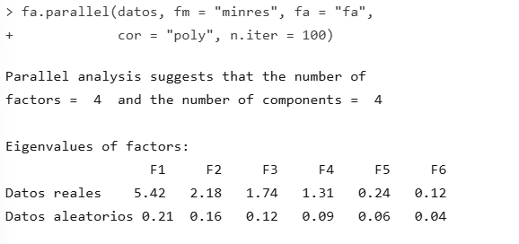

Los 4 primeros factores tienen autovalores reales muy por encima del ruido aleatorio

A partir del factor 5, el autovalor (0,24) ya es muy cercano al aleatorio (0,06) y además menor que 1 (criterio Kaiser)

___

#### **screeplot**

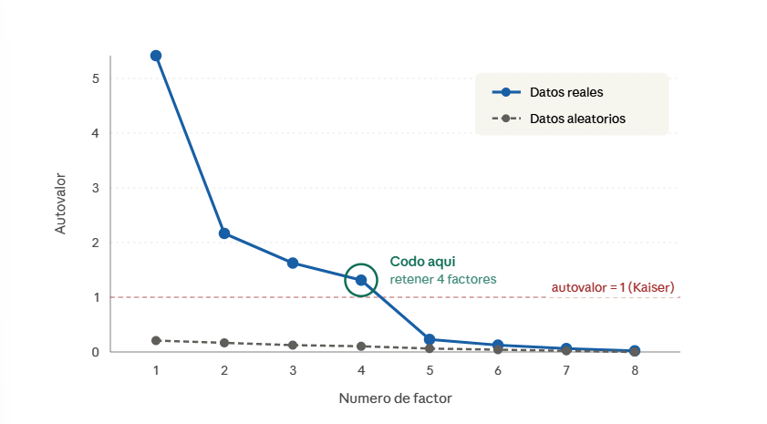

La curva azul cae fuerte en los primeros 4 factores y se aplana después

El codo se ubica entre el factor 4 y el 5
___

**NOS QUEDAMOS CON 4 FACTORES**

#### **Extracción y Rotación Oblicua**

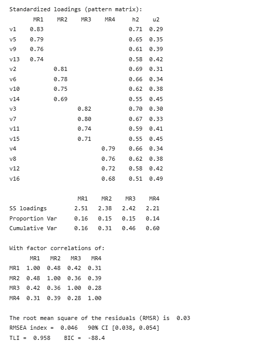

- MR1 agrupa `v1, v5, v9, v13` → ítems sobre satisfacción con la vida en general, consigo mismo, con los logros y con el rumbo.

- MR2 agrupa `v2, v6, v10, v14` → ítems sobre frecuencia con amigos, apoyo familiar, sentirse acompañado y confianza en otros

- MR3 agrupa `v3, v7, v11, v15` → ítems sobre vivienda, ingreso, salud y servicios básicos

- MR4 agrupa `v4, v8, v12, v16` → ítems sobre interés político, asistencia a reuniones, voto y pertenencia a organizaciones

**Comunalidades**

todas razonablemente altas (0,51-0,71). Cada ítem queda bien explicado por la solución factorial

**Varianza Explicada**

los 4 factores juntos explican el 60% de la varianza total

**Correlación entre factores**

todas entre 0,28 y 0,48 por lo tanto moderadas

**indice de ajuste**

- RMSR = 0,03 → excelente

- RMSEA = 0,046 → buen ajuste

- TLI = 0,958 → muy bueno
___ 

## MODELO FINAL!!!!

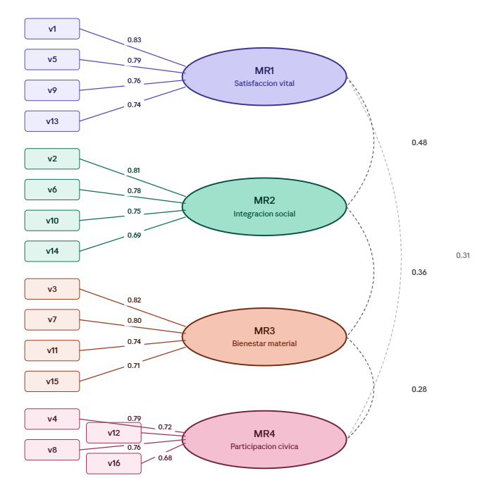

Los cuatro factores que emergen del análisis son cómo se estructura el bienestar, con una dimensión material que tiene que ver con vivienda, ingreso y salud, una subjetiva que apunta a la satisfacción con la propia vida, una social que captura los vínculos con otros y una cívica que refleja la participación en la vida pública. Que estas cuatro dimensiones aparezcan separadas confirma que el bienestar no es unidimensional ni se reduce a tener plata ni a sentirse bien, sino que se juega en varios planos al mismo tiempo. 

Ahora bien, que estén correlacionadas sobre todo lo material con lo subjetivo, donde la correlación llega a 0,48 revela algo central de las sociedades desiguales como la chilena, y es que las condiciones materiales de existencia siguen pesando fuertemente sobre cómo las personas evalúan su propia vida, así que la satisfacción no es un asunto puramente psicológico sino que tiene una base estructural muy concreta.

Por otro lado, la conexión entre integración social y participación cívica (r = 0,39) muestra que los vínculos privados y los públicos se alimentan mutuamente. 

---

## [<strong> Autoría y fuentes </strong>]{style="color:#FF82AB;"}

Este material fue elaborado por <strong>Francisca Hernández</strong> 
(<a href="mailto:francisca.hernandez_c@mail.udp.cl">francisca.hernandez_c@mail.udp.cl</a>),

utilizando desarrollo propio en base a los contenidos del curso. Asimismo, se incorporaron elementos provenientes de las clases del profesor <strong>Gabriel Sotomayor</strong> y recursos complementarios disponibles en internet.