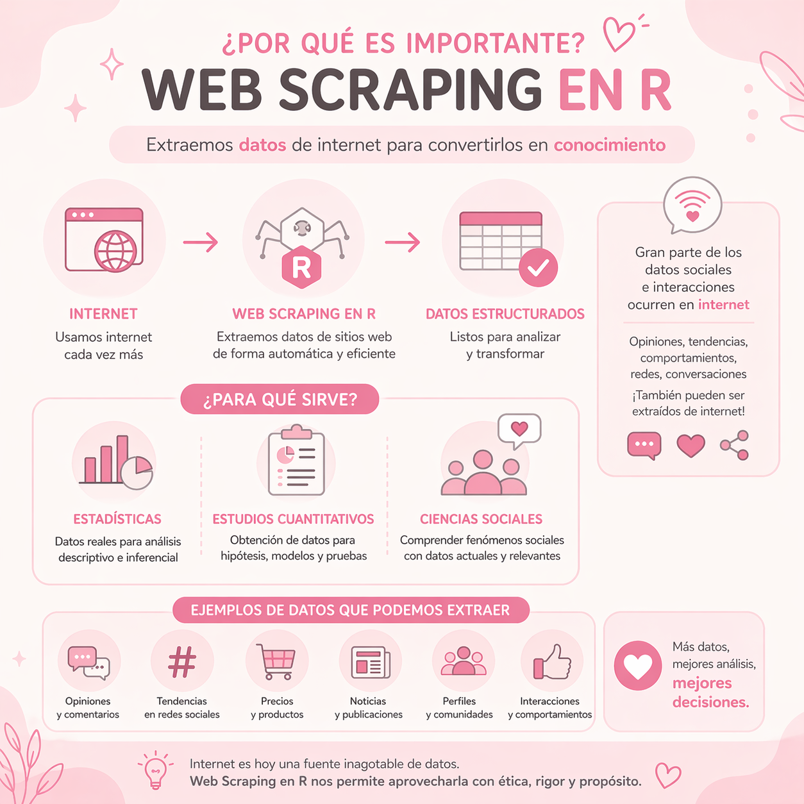
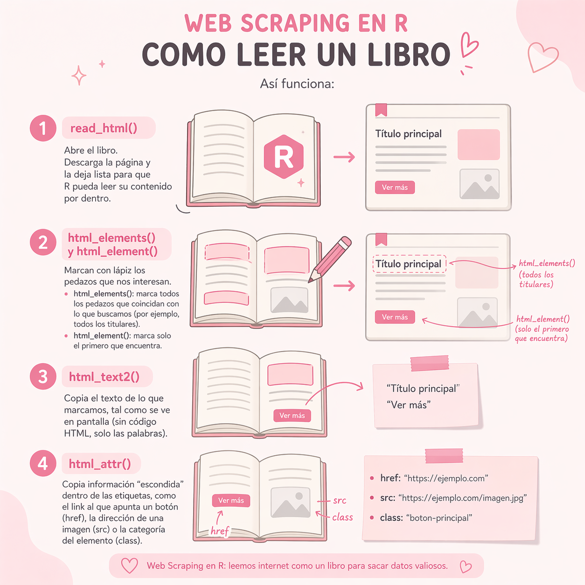
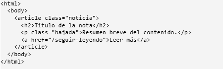
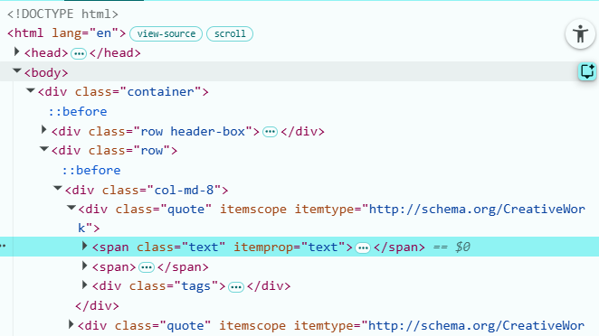
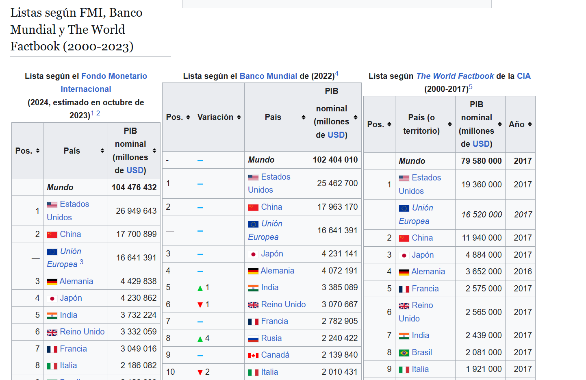
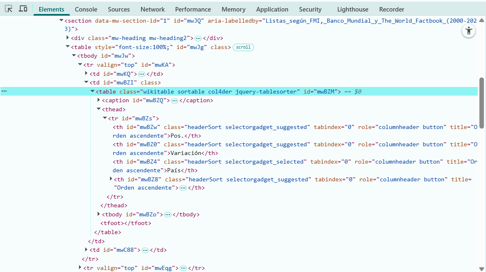

# 1. Qué es el Web Scraping

El web scraping es una técnica automatizada de extracción de datos de sitios web mediante bots o scripts. Permite convertir información no estructurada del código HTML en formatos estructurados.

En lugar de que una persona copie y pegue manualmente los datos, escribimos scripts (programas) que "leen" el contenido de las páginas web, identifican los datos de interés y los guardan

La idea de fondo es simple las páginas web no son más que un documento de texto estructurado. Cuando abrimos una página en el navegador, lo que este hace es interpretar ese texto y mostrarlo de forma visual. Si podemos descargar ese mismo texto, podemos navegar su estructura programáticamente y extraer lo que nos interesa.



::: {.callout-important collapse="true"}
# LEER Consideraciones Importantes

El scraping opera en una zona gris que conviene tomarse en serio, no como trámite sino como parte del diseño metodológico.

-   Muchos sitios prohíben explícitamente el scraping en sus términos de servicio.

-   Un script puede hacer miles de solicitudes por minuto y un humano hace una cada varios segundos. Si bombardeamos un servidor con peticiones automatizadas rápidas, podemos degradar el servicio para usuarios reales, o incluso tumbar sitios pequeños. En R se implementa con `Sys.sleep()` o, más elegante, con `slowly()` de `purrr`.

-   Si un sitio web ofrece una API siempre preferirla antes que scrapear.

-   En Chile, la Ley 19.628 (actualmente en proceso de ser reemplazada por una nueva ley de protección de datos alineada con GDPR) regula el tratamiento de datos personales. En Europa rige directamente el GDPR. Scrapear nombres, correos electrónicos, comentarios identificables o fotografías de personas entra en este terreno regulado, aun cuando la información esté públicamente disponible. La regla simple: si los datos permiten identificar a personas, consultar ética antes de proceder

-   ¿El sitio autoriza el acceso automatizado? La mayoría de los sitios web incluyen en la raíz de su dominio un archivo llamado robots.txt, donde declaran qué rutas están abiertas a bots y cuáles no. No tiene peso legal por sí mismo, pero ignorarlo sistemáticamente es mala práctica. En R podemos consultarlo con el paquete robotstxt:

`library(robotstxt)` `paths_allowed("https://www.sitio-web.cl/seccion/")`

La función devuelve `TRUE` o `FALSE`. Un FALSE no cierra la puerta de manera absoluta, pero debería activar las alarmas y motivar una revisión más profunda.
:::

# 2. Ecosistema en R para Webscraping

Python suele asociarse más con web scraping que R, sobre todo por la popularidad de BeautifulSoup y Scrapy. Pero para quienes trabajamos en ciencias sociales con tidyverse, quedarse en R tiene ventajas que no son triviales: los datos scrapeados caen directamente en tibbles, listos para dplyr, ggplot2 y el resto del flujo de análisis. No hay que cambiar de lenguaje a mitad del proyecto ni aprender dos pipelines paralelos.

## 2.1 rvest

`rvest` es el paquete central. Forma parte del `tidyverse`, está mantenido por el equipo de RStudio y su diseño sigue la misma filosofía de composición con pipes `dplyr`. Su trabajo consiste en dos tareas: descargar el HTML de una página y extraer de él los elementos que le pidamos. Los verbos principales son cuatro:

1.  `read_html()` descarga y parsea una página, dejándola lista para ser navegada

2.  `html_elements()` y `html_element()` marcan con lápiz los pedazos que nos interesan. `html_elements()` marca todos los pedazos que coincidan con lo que buscamos (por ejemplo, todos los titulares) y `html_element()` marca solo el primero que encuentra

3.  `html_text2()` copia el texto de lo que marcamos, tal como se ve en pantalla (sin código HTML, solo las palabras).

4.  `html_attr()` copia información "escondida" dentro de las etiquetas, como el link al que apunta un botón (`href`), la dirección de una imagen (`src`) o la categoría del elemento (`class`).



::: {.callout-tip collapse="true"}
# Nota sobre nombres

En versiones antiguas de rvest, las funciones se llamaban html_nodes() y html_node(). Ambas siguen funcionando, pero la documentación actual prefiere html_elements() y html_element(). Son sinónimos, se puede usar cualquiera. html_text() también sigue existiendo, pero html_text2() maneja mejor los espacios en blanco y saltos de línea.
:::

## 2.2 `chromote`

`rvest` funciona así -\> le pedimos una página, el servidor nos la entrega y la leemos **esto sirve mientras toda la información esté ahí desde el principio**

El problema es que muchas páginas modernas no son así cuando las abrimos, lo que llega al inicio es casi una página en blanco y el contenido aparece recién un par de segundos después, porque el navegador tiene que "armar" la página sobre la marcha (con JavaScript).

Si usamos `rvest` en una página de este tipo, nos devuelve la página vacía, porque `rvest` no sabe esperar a que todo cargue.

**Para estos casos existe chromote**

Lo que hace es abrir un Chrome "invisible" (sin ventana), dejar que la página cargue completa como si la estuviéramos mirando nosotros, y recién ahí entregarnos el contenido listo

Además nos permite simular acciones de un usuario: bajar con el scroll, apretar botones, esperar, etc.

Para usarlo desde `rvest`, en vez de `read_html()` usamos `read_html_live()`

::: {.callout-tip collapse="true"}
## **¿Cómo sé si necesito chromote?**

------------------------------------------------------------------------

Hay una forma muy sencilla de saberlo antes de escribir código.

1.  Abres la página en Chrome

2.  aprietas F12 para abrir las herramientas de desarrollador

3.  desactivas JavaScript (Settings → Debugger → Disable JavaScript)

4.  recargas la página.

**Si la información que quieres sigue apareciendo**

**-\> la página es estática y `rvest` te alcanza**

**Si la página se ve vacía o desapareció el contenido**

**-\> la página es dinámica y necesitás chromote con `read_html_live()`**

Importante: para que chromote funcione, tienes que tener Chrome o Chromium instalado en tu computador
:::

## 2.3 Paquetes Complementarios

Ademas de `rvest` y `chromote` debemos tener los paquetes classicos de R que nos ayudan en gran parte de los proyectos

-   `tidyverse` para manipular los datos una vez extraídos.

-   `stringr` (viene con tidyverse) para limpiar texto

-   `lubridate` para convertir las fechas que vengan como strings a objetos Date

-   `purrr` para combinar los resultados en una sola tabla

-   `polite` para formalizar las buenas prácticas revisa robots.txt automáticamente, etc.

## 2.4 Instalación en R

Si es primera vez que hacemos webscraping o utilizamos R , lo primero que hay que hacer es instalar los paquetes necesarios y luego llamarlos

```{r}
#| warning: false
#| message: false


#install.packages(c( "rvest", "tidyverse", "chromote", "lubridate", "purrr", "polite", "robotstxt"))

library(rvest)
library(tidyverse)
library(chromote)
library(lubridate)


```

# 3. Selectores y anatomía de un HTML

Cualquier proyecto de scraping depende de una habilidad que no es programación sino saber mirar el HTML de una página y reconocer cómo están organizados los datos que queremos

## 3.1 El esqueleto del HTML

Una página web es un documento de texto con etiquetasdonde cada etiqueta envuelve un contenido y puede anidarse dentro de otras, formando como un árbol

Un ejemplo puede ser :



::: {.callout-important collapse="true"}
# **¿Cómo llego a ver el esqueleto?**

Inspector del navegador En cualquier página web

1.  Click derecho

2.  "Inspeccionar" (o "Inspect" en inglés)

O atajos de teclado: F12 o Ctrl + Shift + I
:::

Piensa en el HTML como cajas dentro de cajas

::: caja-rosa
Una forma útil de identificar el esqueleto y a dónde queremos extraer es utilizar la extensión de Chrome **SelectorGadget**, que puedes encontrar haciendo click [aquí](https://chromewebstore.google.com/detail/selectorgadget/mhjhnkcfbdhnjickkkdbjoemdmbfginb?hl=es).
:::

# 4. Scrapeo en pagina estatica

Empezamos con un sitio diseñado especialmente para aprender: quotes.toscrape.com es un entorno de práctica que imita un repositorio de citas célebres. No tiene términos de servicio restrictivos, no cambia su estructura, y presenta exactamente los elementos típicos de cualquier página real listados, paginación, enlaces a fichas individuales sin las sorpresas de un sitio en producción. Es el puente ideal entre la teoría de la sección anterior y los sitios complejos que veremos después.

Aunque el contenido son frases de autores, el ejercicio es equivalente a extraer declaraciones de entrevistados, fragmentos de discurso parlamentario o piezas citables, la técnica es la misma; lo que cambia es el material.

## 4.1 Descargar la pagina

Definimos la URL y la leemos. rvest hace la petición HTTP, recibe el HTML y lo deja como un objeto listo para ser recorrido

```{r}
url <- "https://quotes.toscrape.com/"
pagina <- read_html(url)
pagina

```

El objeto pagina no es un dataframe ni un texto plano es una estructura jerárquica que espejo el árbol HTML del sitio. Todavía no hemos extraído nada, solo tenemos la materia prima sobre la que aplicaremos selectores.

## 4.2 Entender la estructura del sitio

Antes de extraer cualquier cosa, necesitamos ver cómo está armada la página por dentro. Para esto, en Chrome (o cualquier navegador) hacemos click derecho sobre una cita y elegimos "Inspeccionar". Se abre un panel al costado que nos muestra el código HTML de la página, resaltando justo el pedazo donde hicimos click. Mirando ahí, vemos que cada cita está dentro de un bloque que se repite con la misma forma



la línea que el navegador te muestra resaltada corresponde al elemento sobre el se hizo click, en este caso, el texto de una cita.

### Como leer esa información

Cada línea del HTML te dice tres cosas importantes:

1.  La etiqueta: lo primero que aparece después del \<. En este caso es span.

2.  La clase: lo que viene en class="...". En este caso es text.

3.  El contenido: lo que está adentro, representado por los tres puntitos ... (están colapsados, pero ahí está el texto de la cita). Con esos datos ya tenemos el selector para R, como es una clase, le ponemos un punto adelante → .text

| Lo que ves               | Qué guarda                      | Selector en R |
|--------------------------|---------------------------------|---------------|
| `<div class="quote">`    | el bloque completo de cada cita | `.quote`      |
| `<span class="text">`    | el texto de la cita             | `.text`       |
| `<small class="author">` | el nombre del autor             | `.author`     |
| `<a class="tag">`        | cada etiqueta temática          | `.tag`        |

## 4.3 Extraer

La mejor estrategia es ir de a poco, sacar un campo, verificar que esté bien, después el siguiente. Si tratamos de armar todo de una vez y algo falla, no vamos a saber dónde está el problema

**Empezamos con las citas** como vimos que están en `<span class="text">`, el selector es `.text`

```{r}
# Toma la página web guardada en "pagina"
citas <- pagina %>% 
# Busca todos los elementos HTML con la clase ".text"
  html_elements(".text") %>% 
# Extrae solo el texto de esos elementos
  html_text2()

head(citas, 3)

```

**Ahora con los autores**

```{r}
# Toma la página web guardada en "pagina"
autores <- pagina %>% 
# Busca todos los elementos HTML con la clase ".author"
  html_elements(".author") %>% 
# Extrae solo el texto de esos elementos
  html_text2()

head(autores, 3)
```

## 4.4 Etiquetas

Las etiquetas son más complicadas porque cada cita puede tener varias, si extraemos todas las etiquetas de la página de una sola vez, nos queda un vector largo donde no sabemos cuáles pertenecen a cuál cita.

La solución es cambiar de enfoque: primero seleccionamos el bloque entero de cada cita `<div class="quote">` y dentro de cada bloque sacamos sus etiquetas

```{r}
# Primero, los bloques completos de cada cita (los div class="quote")
bloques <- pagina %>%  html_elements(".quote")

# Para cada bloque, extraemos sus etiquetas
etiquetas <- bloques %>% 
  map(\(bloque) bloque %>% 
        html_elements(".tag") %>% 
        html_text2())
```

El resultado es una lista cada elemento contiene las etiquetas de una cita. Suena raro tener una "lista dentro de una tabla", pero a tibble no le molesta y respeta la estructura real de los datos

## 4.5 Armar la tabla

```{r}
df_citas <- tibble(
  cita = citas,
  autor = autores,
  etiquetas = etiquetas
)

df_citas
```

Nos queda una tabla de 10 filas y 3 columnas. Sobre esto ya podemos trabajar con dplyr como con cualquier otro dataframe

## 4.6 Unir en un solo DataFrame

Hasta ahora trabajamos solo con la primera página. Pero quotes.toscrape tiene varias, la página 2, la 3, etc. Para recorrerlas todas, necesitamos dos cosas

Primero, convertir lo que ya hicimos en una función que reciba una URL y devuelva la tabla con sus 10 citas

```{r}
# Crea una función llamada scrapear_pagina_citas
# que recibe una URL como argumento
scrapear_pagina_citas <- function(url) {
  # Lee y descarga el HTML de la página
  pagina <- read_html(url)
  # Busca todos los bloques con clase ".quote"
  bloques <- pagina %>% html_elements(".quote")
  # Crea un tibble con la información extraída
  tibble(
    # Extrae el texto de cada cita
    cita = bloques %>%  
      html_element(".text") %>%  
      html_text2(),
    # Extrae el autor de cada cita
    autor = bloques %>% 
      html_element(".author") %>%  
      html_text2(),
    # Extrae todas las etiquetas/tags de cada cita
    etiquetas = bloques %>% 
      # Recorre cada bloque individualmente
      map(\(b) b %>% 
            # Busca elementos con clase ".tag"
            html_elements(".tag") %>% 
            # Extrae el texto de cada tag
            html_text2()))}

```

::: caja-rosa
acá usamos `html_element()` (singular) sobre bloques, esto significa "para cada bloque, traeme el primer elemento que coincida". Como dentro de cada `<div class="quote">` hay solo un `<span class="text">` y un `<small class="author">`, nos queda más limpio
:::

Segundo, armamos un vector con las URLs de todas las páginas que queremos y aplicamos la función a cada una Para esto usamos `map_dfr()` de `purrr`, que aplica la función a cada URL y va apilando los resultados en una sola tabla

```{r}
# Crea una lista de URLs:
# https://quotes.toscrape.com/page/1/
# https://quotes.toscrape.com/page/2/
# ...
# hasta la página 5
urls <- paste0("https://quotes.toscrape.com/page/",1:5,"/")

# Crea una versión "lenta" del scraper
# para esperar 1 segundo entre cada petición
# y no saturar el servidor
scraper_cortes <- slowly(scrapear_pagina_citas,
  rate = rate_delay(1))

# Recorre todas las URLs:
# - scrapea cada página
# - une todos los resultados en un solo dataframe
todas_las_citas <- urls %>% map_dfr(scraper_cortes)

# Muestra el dataframe final con todas las citas
todas_las_citas
```

## 4.7 Sumar los demas datos

Si volvemos a inspeccionar el HTML de la página, dentro de cada `<div class="quote">` hay un enlace "(about)" al lado del autor que lleva a una página con su fecha de nacimiento, lugar y biografía. Esto nos permite practicar un patrón muy común, primero juntamos enlaces, después visitamos cada enlace para sacar más información

```{r}
# Desde la página HTML guardada en "pagina"
urls_autores <- pagina %>% 
  # Busca todos los bloques de citas
  html_elements(".quote") %>% 
  # Dentro de cada cita, busca el link del autor
  # ".author + a" significa:
  # "el <a> que viene justo después de .author"
  html_element(".author + a") %>% 
  # Extrae el atributo href (el enlace)
  html_attr("href")
# Los links extraídos son relativos:
# ej: "/author/Albert-Einstein"
# Entonces se agrega el dominio para crear URLs completas
urls_autores <- paste0(  "https://quotes.toscrape.com",urls_autores)
# Muestra las primeras URLs encontradas
head(urls_autores)

```

Ahora la función que visita la página de un autor acá introducimos **`tryCatch()`**, que es fundamental en scraping sirve para que, si una página falla, el resto del proceso siga andando. Sin `tryCatch()`, un solo error nos rompe todo

```{r}
# Crea una función para extraer información
# de la página de un autor
extraer_ficha_autor <- function(url) {
  # Intenta ejecutar el scraping
  # Si ocurre un error, evita que el código se rompa
  tryCatch({
    # Lee el HTML de la página del autor
    pagina <- read_html(url)
    # Crea un tibble con la información extraída
    tibble(
    # Guarda la URL del autor
    url_autor = url,
    # Extrae el nombre del autor
    nombre = pagina %>% 
        html_element(".author-title") %>% 
        html_text2(),
    # Extrae la fecha de nacimiento
    nacimiento_fecha = pagina %>% 
        html_element(".author-born-date") %>% 
        html_text2(),
    # Extrae el lugar de nacimiento
    nacimiento_lugar = pagina %>% 
        html_element(".author-born-location") %>% 
        html_text2(),
    # Extrae la biografía del autor
    biografia = pagina %>% 
        html_element(".author-description") %>% 
        html_text2() %>% 
   # Limpia espacios y saltos de línea extra
    str_squish())},
  # Si ocurre un error:
  # devuelve al menos la URL problemática
  error = function(e) {
    tibble(url_autor = url)})}
```

------------------------------------------------------------------------

Aplicamos la función a los enlaces, también con `slowly()`

```{r}
# Crea una versión "lenta" de la función
# para esperar 1 segundo entre solicitudes
# y no saturar el servidor
extraer_lento <- slowly(extraer_ficha_autor, rate = rate_delay(1))
# Recorre todas las URLs de autores:
# - elimina URLs repetidas
# - extrae la información de cada autor
# - une todos los resultados en un solo dataframe
fichas <- urls_autores %>% 
  unique() %>% 
  map_dfr(extraer_lento)

# Muestra el dataframe final con las fichas de autores
fichas
```

# 5. Escrapeo en pagina dinamica

el HTML llega entero del servidor y `rvest` lo lee directo, pero muchos sitios cargan parte del contenido con JavaScript después de abrir la página.

En esos casos `rvest` solo no alcanza, y necesitamos **`chromote`**

Vamos a usar Wikipedia como ejemplo, la mayoría de sus tablas son estáticas, pero algunas tienen partes que se cargan o muestran solo después de interactuar con la página

buscamos extraer estas tablas que nos habla del PIB Nominal



## 5.1 Abrir la página con `chromote`

```{r}
url_wiki <- "https://es.wikipedia.org/wiki/Anexo:Países_por_PIB_(nominal)"
# Acá usamos read_html_live() en vez de read_html()
sesion <- read_html_live(url_wiki)
# Esperamos a que cargue
Sys.sleep(4)

```

`read_html_live()` abre un Chrome invisible detrás de escena, carga la página entera (con su JavaScript ejecutándose) y nos deja interactuar con ella

La variable sesion no es un HTML congelado es un navegador "vivo" que podemos controlar

::: caja-rosa
**¿Por qué la pausa con `Sys.sleep(4)`?**

El navegador necesita tiempo para ejecutar el JavaScript y terminar de armar la página, si tratamos de extraer datos antes de que termine, nos puede devolver una página incompleta sin avisarnos

si tu internet es lento o tu computador no es muy rápido, conviene subir a 6 u 8 segundos.
:::

## 5.2 Interacturar

Si necesitamos hacer algo en la página antes de extraer (scroll, clic, llenar un formulario), `chromote` tiene tres métodos principales

`sesion$scroll_by(top = N)` → baja N píxeles,con 100000 llega al final de casi cualquier página

`sesion$click("selector")` → hace clic en el elemento que indiquemos

(el selector lo identificamos antes con click derecho → Inspeccionar).

`sesion$type("selector", "texto")` → escribe en un campo de formulario.

Para nuestro caso, hacemos scroll hasta abajo para forzar que cargue todo

```{r}
sesion$scroll_by(top = 100000)
Sys.sleep(3)
```

## 5.3 Extraer la tabla

En este caso nos interesa scrapear todos los datos de las tablas 1 y 2, por lo tanto scrapeamos las `wikitables`



::: {.callout-important collapse="true"}
**Tipos de tablas que hay en Wikipedia**

Wikipedia usa varias clases de tabla según el rol que cumple cada una

las que vas a encontrar más seguido son:

wikitable → la clásica, con bordes grises y encabezados sombreados,es la que se usa para datos: listas de países, estadísticas, comparaciones

infobox → el recuadro lateral que aparece arriba a la derecha en muchos artículos (con la foto del personaje, datos biográficos, etc.) técnicamente es una tabla, aunque visualmente parece una ficha

navbox → las cajas de navegación al final de los artículos, con enlaces a temas relacionados

sortable → no es una clase sola, sino que se combina wikitable sortable, significa que la tabla se puede ordenar haciendo clic en los encabezados

mw-collapsible → tablas plegables que se pueden ocultar/mostrar
::: 

```{r}
# Desde la sesión/página web cargada en "sesion"
tabla <- sesion %>% 
  # Busca la primera tabla con clase "wikitable"
  html_element("table.wikitable") %>% 
  # Convierte la tabla HTML en un dataframe
  html_table()
# Muestra la estructura del dataframe
glimpse(tabla)
```
::: caja-rosa
Para encontrar el selector `table.wikitable`, haces click derecho sobre la tabla en Wikipedia → Inspeccionar, y vas a ver una etiqueta `<table class="wikitable">`
:::

`html_table()` hace mucho trabajo por nosotros, detecta los encabezados, respeta celdas combinadas, maneja vacíos.

Lo que devuelve no es perfecto (los números suelen venir como texto, los nombres de columnas pueden tener caracteres raros), pero es un excelente punto de partida.

ahora escrapeamos la tabla 2

```{r}
# Desde la página web guardada en "sesion"
tablas <- sesion %>% 
  # Busca TODAS las tablas con clase "wikitable"
  html_elements("table.wikitable") %>% 
  # Convierte cada tabla HTML en un dataframe
  html_table()
# Cuenta cuántas tablas fueron encontradas
length(tablas)
# Extrae la segunda tabla de la lista
# [[2]] significa: "el elemento número 2"
tabla2 <- tablas[[2]]
```

## 5.4 Limpiar lo extraido

Los datos scrapeados casi nunca vienen listos para usar, los números suelen tener puntos de miles, símbolos de moneda, notas al pie, las fechas vienen en formatos raros hay espacios sobrantes

**La limpieza es parte del trabajo**

```{r}
# Limpia y reorganiza la tabla original
tabla_limpia <- tabla %>%
  # Renombra columnas
  rename(pos = 1,         # posición/ranking
         pais = 2,        # nombre del país
         pib_texto = 3    # PIB en formato texto
         ) %>%
  mutate(
    # Extrae la parte visible del PIB
    # después del primer punto
    pib_visible = str_extract(pib_texto,"\\.(.+)$",group = 1),
    # Limpia el texto del PIB:
    # deja solo números y lo convierte a numeric
    pib = pib_visible %>%
      str_remove_all("[^0-9]") %>%
      as.numeric(),
    # Limpia nombres de países
    pais = map_chr(pais, \(x) {
   #Divide el texto en palabras
    palabras <- str_split(x, "\\s+")[[1]]
    # Cuenta cuántas palabras tiene
     n <- length(palabras)
      # Se queda con la primera mitad
      # y vuelve a unirlas como texto
      paste(palabras[1:ceiling(n/2)],collapse = " ")})) %>%
    # Elimina filas inválidas
  filter(!is.na(pib), pib > 0) %>%
  # Selecciona solo las columnas finales
  select(pos, pais, pib)
# Muestra las primeras 10 filas
head(tabla_limpia, 10)
```

## 5.5 Cerrar el navegador

`chromote` deja corriendo el Chrome invisible mientras la sesión exista, al terminar conviene cerrarlo explícitamente

```{r}
sesion$session$close()
```

Si no lo cerramos, eventualmente se cierra solo cuando R libera la memoria, pero mientras tanto puede quedar consumiendo recursos, para scripts largos o tareas grandes, es buena costumbre cerrar

# 6. Sintesis

El scraping parece muchas cosas distintas, pero en el fondo es siempre el mismo ciclo de 5 pasos:

1. Inspeccionar el HTML (click derecho → Inspeccionar, como hicimos con la cita en quotes.toscrape) y encontrar los selectores

2. Descargar la página con `read_html()` o, si es dinámica, con `read_html_live()`

3. Extraer cada campo con `html_elements()/html_element()` y después `html_text2()` o `html_attr()`

4.Armar un `tibble`, verificando que los largos coincidan, y limpiar con `stringr` y `lubridate`

5. Cuando hay que iterar, encapsular en una función robusta, aplicarla con `map_dfr(slowly(...))`, y guardar antes de limpiar

**Todo proyecto de scraping, por complicado que parezca, se descompone en este esqueleto**

Los sitios cambian, los selectores cambian, pero el patrón siempre funciona

## 6.1 Errores comunes 

### La tabla queda desalineada

Si dos columnas de tu `tibble` tienen distinto largo, algún selector está capturando elementos que el otro no

**La regla** imprimir `length()` de cada vector antes de combinar

### Solo me trae el primer elemento

Es el error más común al empezar confundir `html_element()` (singular, trae uno) con `html_elements()` (plural, trae todos)

Si el resultado es sospechosamente corto, revisa esto 

### El selector no encuentra nada

hay dos causas habituales:

1. la página es dinámica y el contenido todavía no carga → usar `read_html_live()` con pausa

2. El selector está mal escrito (un punto donde va un numeral, una clase mal, etc.) → probar el selector directamente en el navegador antes de usarlo en R, por ejemplo, en el panel de Inspeccionar, hay una pestaña llamada Console ahí escribe `document.querySelectorAll(".text")` y si te devuelve 10 elementos el selector funciona.

### El servidor responde con error (403 o 429)

Significa que el servidor te rechaza o se está saturando

**Solución** agregar más pausa entre peticiones, configurar un  `user-agent` identificable (el paquete polite lo hace automático)

**Si te sigue bloqueando, es señal clara de que no debes insistir**

### `chromote` no encuentra Chrome

`chromote` necesita Chrome o Chromium instalado en el computador, no solo el paquete de R, en Windows y Mac alcanza con instalar Google Chrome

En Linux, instalar chromium-browser con el gestor de paquetes.

## [<strong> Autoría y fuentes </strong>]{style="color:#FF82AB;"}

Este material fue elaborado por <strong>Francisca Hernández</strong> 
(<a href="mailto:franciscapazhernandezcanas@gmail.com">franciscapazhernandezcanas@gmail.com</a>),
utilizando desarrollo propio, se incorporaron elementos provenientes de recursos complementarios disponibles en internet.
